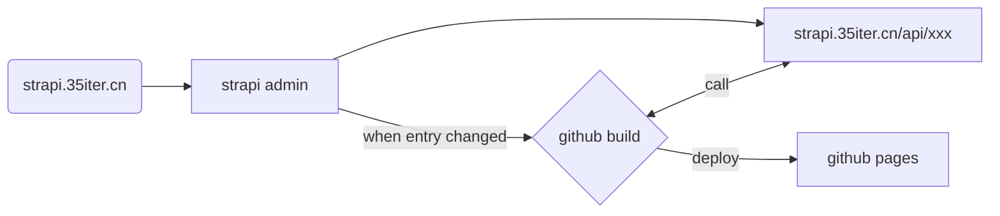

## astro-strapi-cms

本项目使用 astro 和 strapi 进行构建。

astro 是一个类 nextjs 的框架，同样支持服务端渲染和静态网站生成。而 strapi 是一个无头 cms 框架，简单配置即可生成 crud 代码。将 astro 与 strapi 结合，就有了很多可能。

常见的博客网站，可以将博客写到 strapi 里面，然后使用 astro 生成纯静态的网站。

### 部署方式

astro 构建的目标是纯静态网站，所以可以用 github pages 之类的方式进行托管。strapi 会用于博客文章编辑、astro 构建时调用、图片服务器，所以它需要一台服务器运行。

#### 优化

以上构建流程是可以实现的，不过有一个地方需要特别说明。

strapi admin/api 用途主要有：

1. 编辑博客内容
2. astro 静态网站构建时，提供接口
3. 托管媒体文件（图片、视频等）

按照是否与最终用户有关，可以将以上三个功能分成构建前和构建后。如果不考虑托管媒体文件，那么 strapi 可以完全不用考虑性能问题，因为用户不会再调用 strapi 接口了。

而且，前端静态资源是部署到 github pages 上的，如果可以**将托管媒体文件**这一用途移除掉，那么在运行时，不会再有任何服务器资源费用。

#### 具体实现
